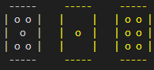
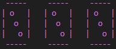
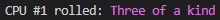
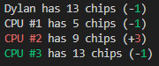

# PoCoLoco - Python Assignment 5

Fifth and final python assignment for Programming 12

Click [here](a5.py) to view the assignment

## Features

- Dice are printed using ASCII art
- Dice are coloured pink if they are a special combination, or yellow if they are a special value (1 or 6)

  

  

- Colours are printed using ANSI escape sequences
- Colours are used to make the UI easier to understand

  

- Green to suggest positive outcomes, and red to suggest negative ones

  
